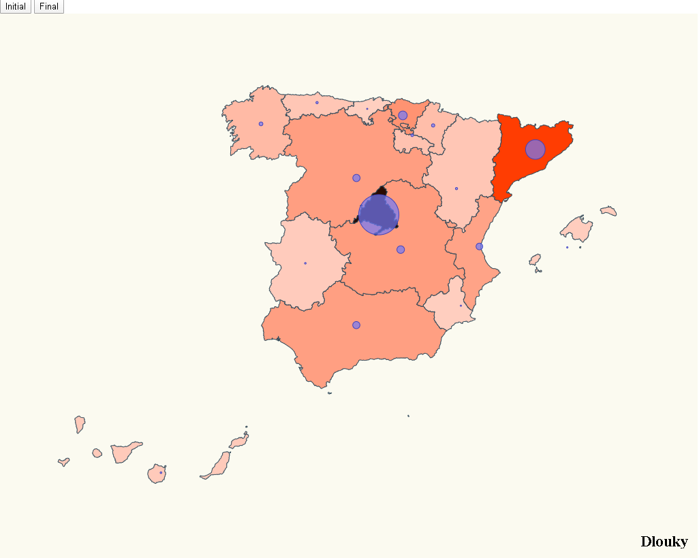

# COVID-19 in SPAIN (Module 9 Mandatory Exercise)

I focus on Spain affection by community displaying a map pinning affected locations and scaling that pin according to the number of cases affected, something like:




I have to face three challenges here:

- Place pins on a map based on location.
- Scale pin radius based on affected number.
- Create buttons to show different data periods.


# Steps

- I will take as starting example _02-pin-location-scale_ from https://github.com/Lemoncode/d3js-typescript-examples/tree/master/02-maps/02-pin-location-scale. Let's copy the content from that folder and execute _npm install_.

```bash
npm install
```

- I use Spain topojson info: https://github.com/deldersveld/topojson/blob/master/countries/spain/spain-comunidad-with-canary-islands.json

Let's copy it under the following route _./src/spain.json_

To create the map, notice that there's a great project created by
  [Roger Veciana](https://github.com/rveciana) that implements a lot of projections for several
  maps:

  - [Project site](https://geoexamples.com/d3-composite-projections/)
  - [Github project](https://github.com/rveciana/d3-composite-projections)

Let's install the library that contains the map projections:

```bash
npm install d3-composite-projections --save
```

- Create communities.ts which has all the communities coordinates.

_./src/communities.ts_

```diff
export const latLongCommunities = [
  {
    name: "Madrid",
    long: -3.70256,
    lat: 40.4165
  },
  {
    name: "Andalucía",
    long: -4.5,
    lat: 37.6
  },
  {
    name: "Valencia",
    long: -0.37739,
    lat: 39.45975
  },
  {
    name: "Murcia",
    long: -1.13004,
    lat: 37.98704
  },
  {
    name: "Extremadura",
    long: -6.16667,
    lat: 39.16667
  },
  {
    name: "Cataluña",
    long: 1.86768,
    lat: 41.82046
  },
  {
    name: "País Vasco",
    long: -2.75,
    lat: 43.0
  },
  {
    name: "Cantabria",
    long: -4.03333,
    lat: 43.2
  },
  {
    name: "Asturias",
    long: -5.86112,
    lat: 43.36662
  },
  {
    name: "Galicia",
    long: -7.86621,
    lat: 42.75508
  },
  {
    name: "Aragón",
    long: -1.0,
    lat: 41.0
  },
  {
    name: "Castilla y León",
    long: -4.45,
    lat: 41.383333
  },
  {
    name: "Castilla La Mancha",
    long: -3.000033,
    lat: 39.500011
  },
  {
    name: "Islas Canarias",
    long: -15.5,
    lat: 28.0
  },
  {
    name: "Islas Baleares",
    long: 2.52136,
    lat: 39.18969
  },
  {
    name: "La Rioja",
    long: -2.44373,
    lat: 42.4650
  },
  {
    name: "Navarra",
    long: -1.676069,
    lat: 42.695391
  }
];

```


- Now create stats.ts where all the cases by community appear in a period of onset and another more contemporary.

_./src/stats.ts_

```diff
export interface ResultEntry {
  name: string;
  value: number;
}

export const initial : ResultEntry[] = [
  {
    name: "Madrid",
    value: 587
  },
  {
    name: "La Rioja",
    value: 102
  },
  {
    name: "Andalucía",
    value: 54
  },
  {
    name: "Cataluña",
    value: 101
  },
  {
    name: "Valencia",
    value: 50
  },
  {
    name: "Murcia",
    value: 5
  },
  {
    name: "Extremadura",
    value: 7
  },
  {
    name: "Castilla La Mancha",
    value: 26
  },
  {
    name: "País Vasco",
    value: 148
  },
  {
    name: "Cantabria",
    value: 12
  },
  {
    name: "Asturias",
    value: 10
  },
  {
    name: "Galicia",
    value: 18
  },
  {
    name: "Aragón",
    value: 32
  },
  {
    name: "Castilla y León",
    value: 40
  },
  {
    name: "Islas Canarias",
    value: 24
  },
  {
    name: "Islas Baleares",
    value: 11
  },
  {
    name: "Navarra",
    value: 13
  }
];

export const final : ResultEntry[] = [
  {
    name: "Madrid",
    value: 9702
  },
  {
    name: "La Rioja",
    value: 654
  },
  {
    name: "Andalucía",
    value: 1725
  },
  {
    name: "Cataluña",
    value: 4704
  },
  {
    name: "Valencia",
    value: 1604
  },
  {
    name: "Murcia",
    value: 296
  },
  {
    name: "Extremadura",
    value: 384
  },
  {
    name: "Castilla La Mancha",
    value: 1819
  },
  {
    name: "País Vasco",
    value: 2097
  },
  {
    name: "Cantabria",
    value: 282
  },
  {
    name: "Asturias",
    value: 545
  },
  {
    name: "Galicia",
    value: 915
  },
  {
    name: "Aragón",
    value: 532
  },
  {
    name: "Castilla y León",
    value: 1744
  },
  {
    name: "Islas Canarias",
    value: 414
  },
  {
    name: "Islas Baleares",
    value: 331
  },
  {
    name: "Navarra",
    value: 794
  }
];
```

- Create map.css to define the map styles.

_./src/stats.ts_

```diff
.country {
  stroke-width: 1;
  stroke: #2f4858;
  fill: #008c86;
}

.affected-marker {
  stroke-width: 1;
  stroke: #bc5b40;
  fill: #f88f70;
  fill-opacity: 0.7;
}
```

- Import all the files and libraries created above

_./src/index.ts_

```diff
import * as d3 from "d3";
import * as topojson from "topojson-client";
const spainjson = require("./spain.json");
const d3Composite = require("d3-composite-projections");
import { latLongCommunities } from "./communities";
import { initial, final, ResultEntry } from "./stats";
```

- Now define a function to calculate the readius of each circle according to the number of infected cases.

_./src/index.ts_
```diff
const calculateRadiusBasedOnAffectedCases = (comunidad: string, data: ResultEntry[]) => {
  const entry = data.find(item => item.name === comunidad);
  const maxAffected = 10000/*data.reduce(
    (max, item) => (item.value > max ? item.value : max),
    0
  );*/

  const affectedRadiusScale = d3
  .scaleLinear()
  .domain([0, maxAffected])
  .range([0, 50]); // 50 pixel max radius, we could calculate it relative to width and height
  
  return entry ? affectedRadiusScale(entry.value) : 0;
};
```

- Let's build the spain map:

_./src/index.ts_

```diff
const svg = d3
  .select("body")
  .append("svg")
  .attr("width", 1024)
  .attr("height", 800)
  .attr("style", "background-color: #FBFAF0");

const aProjection = d3Composite
  .geoConicConformalSpain()
  // Let's make the map bigger to fit in our resolution
  .scale(3300)
  // Let's center the map
  .translate([500, 400]);

const geoPath = d3.geoPath().projection(aProjection);
const geojson = topojson.feature(spainjson, spainjson.objects.ESP_adm1);

svg
  .selectAll("path")
  .data(geojson["features"])
  .enter()
  .append("path")
  .attr("class", "country")
  // data loaded from json file
  .attr("d", geoPath as any);
```

```diff
const geojson = topojson.feature(
+  spainjson,
+  spainjson.objects.ESP_adm1
);
```

- Create the circles:

_./src/index.ts_

```diff
svg
  .selectAll("circle")
  .data(latLongCommunities)
  
  .enter()
  .append("circle")
  .attr("class", "affected-marker")
  .attr("r", d => calculateRadiusBasedOnAffectedCases(d.name, initial))
  .attr("cx", d => aProjection([d.long, d.lat])[0])
  .attr("cy", d => aProjection([d.long, d.lat])[1])
  ;
```

- Define a function to update the radius of the circles:

_./src/index.ts_

```diff
const updateCircles = (data: ResultEntry[]) => {
  svg.selectAll("circle")
  .data(latLongCommunities)
  .merge(svg as any)
  .transition()
  .duration(500)
  .attr("r", d => calculateRadiusBasedOnAffectedCases(d.name, data))
  .attr("cx", d => aProjection([d.long, d.lat])[0])
  .attr("cy", d => aProjection([d.long, d.lat])[1]);
};
```

- Create the buttons.

_./src/index.html_

```diff
<html>
  <head>
    <link rel="stylesheet" type="text/css" href="./map.css" />
    <link rel="stylesheet" type="text/css" href="./base.css" />
  </head>
  <body>
    <div>
+      <button id="initial">Initial</button>
+      <button id="final">Final</button>
    </div>
    <script src="./index.ts"></script>
  </body>
</html>
```


- Set the button behavior.

_./src/index.ts_

```diff
document
.getElementById("initial")
.addEventListener("click", function handleResultsInitial() {
  updateCircles(initial);
});

document
.getElementById("final")
.addEventListener("click", function handleResultsFinal() {
  updateCircles(final);
});
```

- If we run the project, voila ! we got the map just the way we want it.

```bash
npm start
```


# Knowledge
- Spain topojson info:
https://github.com/deldersveld/topojson/blob/master/countries/spain/spain-comunidad-with-canary-islands.json
- d3js-typescript-examples
https://github.com/Lemoncode/d3js-typescript-examples/tree/master/02-maps/02-pin-location-scale
